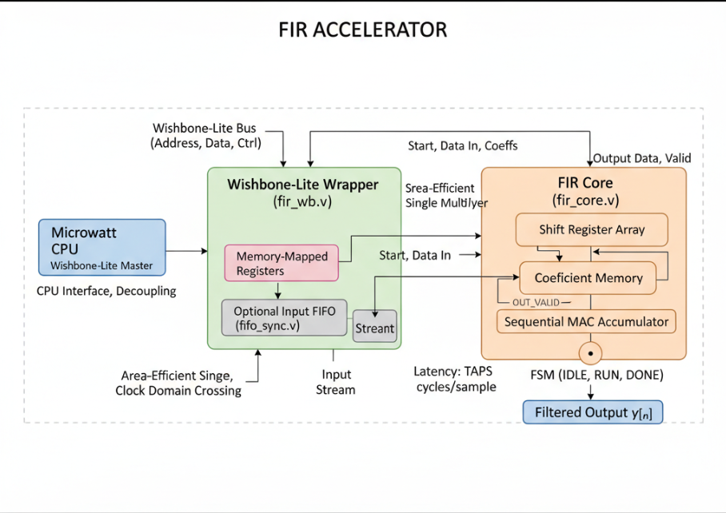

# FIR Accelerator — Microwatt Hackathon Submission



---

## Executive Summary / Motivation

Digital signal processing (DSP) is fundamental across communications, audio, sensor fusion, and control systems. Many DSP tasks are dominated by repeated multiply–accumulate operations. A dedicated hardware FIR accelerator offloads this work from the CPU, delivering **lower latency, reduced CPU load, and improved energy efficiency** — critical for edge and embedded systems such as those using Microwatt.

This project implements a **parameterizable FIR filter accelerator** (`fir_accel.sv`) and a **Wishbone-Lite register wrapper** (`wishbone_fir_if.sv`) to expose the accelerator as a memory-mapped peripheral. The design is synthesizable SystemVerilog, verified with a self-checking testbench (`tb_fir_top.sv`), and comes with a firmware example (`sw/examples/accel_test.c`). It is prepared for integration into OpenFrame/Microwatt and for ASIC (Sky130)/FPGA flows.

---

## Why FIR filters matter (what is FIR, and why use hardware)

### What is an FIR filter?

An FIR (Finite Impulse Response) filter computes each output sample `y[n]` as a finite weighted sum of current and past input samples:

$$
y[n] = \sum_{i=0}^{N-1} h[i] \cdot x[n-i]
$$

where:

* `N` = number of taps,
* `h[i]` = filter coefficients,
* `x[n-i]` = past input samples (delay line).

Properties:

* **Finite impulse response** (output depends only on a finite number of past inputs).
* Can be designed to have **exact linear phase** (important for audio and control).
* **Always stable** (no feedback), simpler arithmetic than IIR.
* Suited for hardware: regular multiply-accumulate (MAC) workload, easy to pipeline or reuse a single MAC unit sequentially.

### Why accelerate FIR in hardware?

* CPU-based FIR (software) consumes many cycles and energy for multiply–accumulate loops, reducing available compute for other tasks.
* A dedicated FIR accelerator provides:

  * **Deterministic latency** (fixed cycles per sample),
  * **Lower power** per sample (less general-purpose switching and overhead),
  * **Reduced CPU load** (freeing CPU for control, higher-level algorithms),
  * **Compact area** if implemented as sequential MAC (single multiplier reused across taps) — ideal for SoC/edge constraints.

---

## Why mention FFT here? What is FFT and why it's important

### What is the FFT?

The Fast Fourier Transform (FFT) is an efficient algorithm to compute the Discrete Fourier Transform (DFT), which translates a discrete time-domain signal into the frequency domain. For a length-`M` sequence `x[n]`, the DFT is:

$$
X[k] = \sum_{n=0}^{M-1} x[n] \cdot e^{-j 2\pi \frac{kn}{M}}, \quad k = 0,\dots,M-1
$$

An FFT computes the same result with `O(M log M)` complexity instead of `O(M^2)`.

### Why FFT matters for filtering

* **Convolution theorem**: time-domain convolution corresponds to multiplication in frequency domain.

  * Convolution: `y = x * h` (time domain)
  * Equivalent: `Y = X \cdot H` (frequency domain)
* For **long filters** (large `N`) and/or long blocks, **FFT-based convolution** (blockwise FFT of input and coefficients, pointwise multiplication, inverse FFT, overlap-save/overlap-add) can be *much* more efficient than direct time-domain convolution. Complexity shifts from `O(N * L)` to about `O(L log L)` for block length `L`, so it’s preferred for large-N or high-throughput streaming applications.

### Relationship to this FIR accelerator

* The current accelerator is a **time-domain FIR core** (sequential MAC per tap) — excellent for short-to-moderate tap counts and low area.
* For large tap counts or streaming millisecond-scale filters, an **FFT-based accelerator** or hybrid (time-domain for small N, FFT-based for large N) could be considered as a future extension.
* Practical path: this project implements a compact FIR core now and lists **FFT-based convolution / frequency-domain accelerator** as a roadmap extension (see Roadmap & Extensions).

---

## Current Progress

* **Core & Wrapper Implemented:** A configurable FIR core (`fir_accel.sv`) and Wishbone register interface (`wishbone_fir_if.sv`) are implemented. `TAPS` and `WIDTH` parameters supported.
* **Testbench Verified:** `tb_fir_top.sv` programs coefficients, feeds input samples, compares outputs vs golden model (moving average, all-ones, alternating signs). PASS/FAIL logging and waveform dump are provided.
* **Firmware Example:** `sw/examples/accel_test.c` demonstrates the required sequence: write coefficients, write sample, start, poll done, read output, clear start.
* **Documentation:** `docs/DESIGN.md` includes memory map and integration notes for OpenFrame/Microwatt.
* **Next Steps:** Randomized/regression tests, streaming/DMA mode, interrupt support, clocking/timing checks, and OpenLane Sky130 flow preparation.

---

## High-Level Architecture

Components and how they connect:

* **Microwatt CPU / Bus Master** — issues Wishbone read/write transactions.
* **`wishbone_fir_if`** — Wishbone-Lite slave register wrapper. Memory mapped control interface for `fir_accel`.
* **`fir_accel`** — FIR datapath core (shift register, coefficients, sequential MAC, saturation).
* **`tb_fir_top.sv`** — testbench (drives `fir_accel` directly for verification).
* **`sw/examples/accel_test.c`** — example CPU-side firmware sequence.
* **`docs/DESIGN.md`** — integration guide & memory map.

Separation of datapath (FIR core) and control plane (bus wrapper) maintains modularity and reusability.

---

### `verilog/rtl/accel/fir_accel.sv` — FIR core (datapath)

* Parameterizable: `TAPS`, `WIDTH`.
* Ports: `clk`, `rst_n`, `start`, `sample_in` (signed), `sample_out` (signed), `done`, `coeff_wr_en`, `coeff_wr_addr`, `coeff_wr_data`.
* Internals:

  * `regs[0..TAPS-1]` — delay line (shift-register of samples).
  * `coeffs[0..TAPS-1]` — coefficient memory.
  * Accumulator sized to `2*WIDTH` (products WIDTH×WIDTH produce up to 2×WIDTH bits).
  * FSM: `IDLE → RUN → DONE_S → IDLE`.
* Behavior:

  * On `start`, shift in `sample_in`, iterate TAPS multiply-add cycles: `acc = Σ coeffs[i] * regs[i]`.
  * Saturate final value to `WIDTH` bits signed range and present as `sample_out`.
* Important semantics:

  * `done` is held high in DONE\_S until `start` is cleared.
  * Coeff writes allowed at any time (race condition if changed during RUN).

### `verilog/rtl/bus/wishbone_fir_if.sv` — Wishbone wrapper (control plane)

* Memory-mapped registers at base address `0x4000_0000` (documented in `docs/DESIGN.md`).
* Register map:

  * `0x00` — CTRL (bit0 = START)
  * `0x04` — DATAIN (write sample\_in)
  * `0x08` — DATAOUT (read sample\_out)
  * `0x0C` — STATUS (bit0 = DONE)
  * `0x10 + 4*i` — COEFF\[i] writes
* Behavior:

  * Writes to COEFF generate a one-cycle `coeff_wr_en` pulse with `coeff_wr_addr` and `coeff_wr_data`.
  * Writes to CTRL latch `reg_ctrl` (start = reg\_ctrl\[0]); software must manage setting and clearing this bit.
  * Simple single-cycle `wb_ack_o` for each operation.
* Important notes:

  * Wrapper does not block coefficient writes during RUN.
  * Wrapper’s coefficient address width (4 bits) supports up to 16 taps — ensure top-level matches core’s `$clog2(TAPS)`.

### `verilog/dv/tb_fir_top.sv` — Testbench

* Drives the core directly (bypasses Wishbone wrapper).
* Helper tasks:

  * `write_coeff(idx, val)` — pulses `coeff_wr_en`, records in TB mirror.
  * `golden(new_sample)` — software model computing identical MAC and saturation.
  * `feed_sample(s)` — pulses `start` with `sample_in = s`, waits for `done`, compares output to `golden(s)`.
* Test cases: moving average, all ones, alternating coefficients.
* Waveform dump: `$dumpfile("fir_tb.vcd"); $dumpvars(0, tb_fir_top);`.
* Run commands (Icarus Verilog):

  ```bash
  iverilog -g2012 -o fir_tb.vvp verilog/rtl/accel/fir_accel.sv verilog/dv/tb_fir_top.sv
  vvp fir_tb.vvp
  ```

  Then view `fir_tb.vcd` in GTKWave.

### `sw/examples/accel_test.c` — Firmware usage example

* Example sequence:

  1. Write COEFF registers (`base+0x10+4*i`).
  2. Write DATAIN (`base+0x04`).
  3. Write CTRL (`base+0x00`) = 1 (start).
  4. Poll STATUS (`base+0x0C`) until DONE (bit0 == 1).
  5. Read DATAOUT (`base+0x08`).
  6. **Clear CTRL** (`base+0x00`) = 0 — **important** to allow core to IDLE for next start.

### `docs/DESIGN.md` — Documentation & memory map

* Explains integration steps, address map, and firmware sequence.
* Should be expanded with diagrams, timing constraints, and OpenFrame top integration instructions.

---

## Operational Flow — precise CPU ↔ Accelerator interactions

1. **Configuration:** CPU writes coefficients into `COEFF[i]` registers.
2. **Input:** CPU writes a new input sample to `DATAIN`.
3. **Execution:** CPU writes `CTRL.START = 1`. The wrapper sets `start` in the core.
4. **Computation:** Core shifts the sample into the delay line, runs TAPS MAC cycles.
5. **Completion:** `sample_out` is produced and `done` asserted.
6. **Readout:** CPU polls `STATUS` or waits for IRQ (if implemented), then reads `DATAOUT`.
7. **Cleanup:** CPU writes `CTRL.START = 0` to allow core to return to IDLE.

**Deterministic latency:** approximate latency is `TAPS` cycles (plus a small FSM overhead) because MAC is sequential. Throughput is therefore one output per `TAPS` cycles.

---

## Timing & Latency trade-offs

* **Sequential MAC architecture:**

  * Area-efficient (single multiplier reused).
  * Latency: ≈ `TAPS` cycles per sample.
  * Not pipelined — cannot accept new input until the current run finishes (unless redesigned).
* **Parallel / pipelined alternative:**

  * Multiple MAC units or pipelined multiply-adds increase throughput (one result per cycle with sufficient parallelism) at the cost of area and complexity.
* **FFT-based filtering (see above):**

  * Better for large `N` or long-stream, lower asymptotic complexity (blockwise FFT convolution).

---

## Important Implementation Details, Edge Cases, and Potential Bugs

1. **Start semantics and done behavior**

   * Core is level-sensitive on `start`, and `done` remains asserted while `start` is high. Software must clear START (write `0`) after reading `DATAOUT`, or the core will remain in DONE\_S and refuse further starts.
   * Fix options:

     * Firmware: `write start=1; poll done; write start=0`.
     * Change core: implement a write-one-to-start (self-clearing) or produce a single-cycle `done` pulse independent of `start`.
2. **Coefficient writes during processing**

   * Core accepts coefficient writes any time; changing coefficients mid-run results in undefined outputs for that run.
   * Fix options:

     * Wrapper blocks COEFF writes while core is busy.
     * Core freezes coefficient memory while `RUN`.
3. **Accumulator width and saturation**

   * Accumulator currently `2*WIDTH` bits — conservative and safe.
   * Option to reduce width: `WIDTH + $clog2(TAPS)` (plus sign bit) if area critical.
   * Carefully handle sign extension during saturation.
4. **Wishbone ack and bus semantics**

   * Wrapper uses single-cycle `wb_ack_o`. Works for simple masters but not full pipelined transactions. Verify with Microwatt bus expectations.
5. **Width/port mismatches**

   * Ensure wrapper `coeff_wr_addr` width matches core `$clog2(TAPS)`. Wrapper currently 4 bits (16 taps). Align during top-level instantiation.
6. **Reset initialization**

   * Coeffs and regs reset to zero. Verify wrapper registers reset cleanly as well.
7. **Synthesis compatibility**

   * Use explicit sizes (avoid `int` unsized types). Test with Yosys and vendor toolchains. For Sky130/OpenLane ensure coding style fits constraints.

---

## Simulation & Debug Tips

* **Compile & run TB**:

  ```bash
  iverilog -g2012 -o fir_tb.vvp verilog/rtl/accel/fir_accel.sv verilog/dv/tb_fir_top.sv
  vvp fir_tb.vvp
  ```
* **Waveform**: `fir_tb.vcd` — inspect in GTKWave.
* **Observables**: `clk`, `rst_n`, `start`, `sample_in`, `coeff_wr_en`, `acc`, `sample_out`, `done`.
* **Add debug aids**: `$display` for internal accumulators or `$assert` for invariants.
* **Firmware integration**: If integrating with Microwatt sim, ensure correct memory ordering for write sequences.

---

## Verification & Validation Plan

* **Golden Reference Model**: Software FIR implemented in TB (exact arithmetic + identical saturation).
* **Test Scenarios**:

  * Deterministic: moving average, all ones, alternating coefficients.
  * Randomized stress tests (random input/coeffs).
  * Corner cases: maximal positive/negative samples (saturation).
  * Concurrent/illegal ops: coeff change during RUN, reset during RUN.
* **Outputs**:

  * Console PASS/FAIL logging.
  * Waveform dumps for failing cases.
* **Advanced**:

  * Formal assertions for state invariants and address bounds.
  * Add regression harness (Makefile/CI) with deterministic random seeds.
  * Post-synthesis gate-level simulation + SDF timing if moving to ASIC flow.

---

## Synthesis & Implementation Considerations

* **Top-level parameter check**: Ensure `TAPS`/`WIDTH` match between `fir_accel` and `wishbone_fir_if`.
* **Clock / timing**: For high clock targets, consider pipelining or DSP blocks.
* **Streaming / DMA**: For high-throughput streaming, add FIFO/DMA and streaming interface.
* **Interrupts**: Expose IRQ on `done` for power-efficient CPU usage.
* **OpenFrame/Microwatt integration**:

  * Instantiate `wishbone_fir_if` with base address `0x4000_0000`.
  * Connect bus interconnect and address decoder.
  * Validate Microwatt master timing and ack expectations.
* **ASIC (Sky130) / OpenLane**:

  * Prepare OpenLane config and check design fits OpenFrame user area.
  * Add SDC timing constraints, I/O planning, and pre-DFT steps as needed.

---

## Roadmap & Extensions (future work)

* **Interrupt support** for event-driven processing.
* **Streaming mode** with FIFO or DMA support for continuous filtering.
* **FFT-based / frequency-domain accelerator** for large-N convolution (overlap-save / overlap-add).
* **Parallelism parameterization** (multiple MAC units) for higher throughput.
* **Formal verification** of arithmetic correctness and control FSM safety.
* **OpenLane Sky130 flow**: scripts for reproducible ASIC runs and integration into OpenFrame.

---

## Quick Checklist (practical fixes & enhancements)

1. Decide `start` semantics (make write-one-to-start or wrapper auto-clear).
2. Guard coefficient writes while RUN (block/defer/error).
3. Match `coeff_wr_addr` width between wrapper & core.
4. Add IRQ line for `done`.
5. Add randomized regression tests and include in CI/Makefile.
6. Add streaming mode/FIFO for higher throughput.
7. Add RTL assertions for invariants.
8. Run top-level integration with Microwatt (sim/FPGA) before ASIC flow.
9. Expand `docs/DESIGN.md` with diagrams and precise firmware sequences.
10. Provide reproducible OpenLane/OpenFrame build scripts.

---

## Example software usage — step-by-step (safe)

To process **one** sample correctly:

```text
BASE = 0x4000_0000   # wrapper base

# 1. Write coefficients
for i in 0..TAPS-1:
    write32(BASE + 0x10 + 4*i, coeff[i])

# 2. Write input sample
write32(BASE + 0x04, sample)

# 3. Start processing
write32(BASE + 0x00, 0x1)  # CTRL.START = 1

# 4. Poll until done
while ((read32(BASE + 0x0C) & 0x1) == 0):
    # optional sleep/backoff

# 5. Read output
y = read32(BASE + 0x08)

# 6. Clear start before next run (important)
write32(BASE + 0x00, 0x0)
```

**Important**: step 6 (clear START) is required because the core uses level-sensitive `start` and holds `done` until `start` == 0. If you omit clearing START, you will remain in DONE\_S and cannot restart the core.

---

## Verification commands (how to run what we have now)

* Compile & run testbench (Icarus Verilog):

  ```bash
  iverilog -g2012 -o fir_tb.vvp verilog/rtl/accel/fir_accel.sv verilog/dv/tb_fir_top.sv
  vvp fir_tb.vvp
  ```
* Open waveform:

  ```bash
  gtkwave fir_tb.vcd
  ```
* Inspect PASS/FAIL logs printed to console by the TB.
